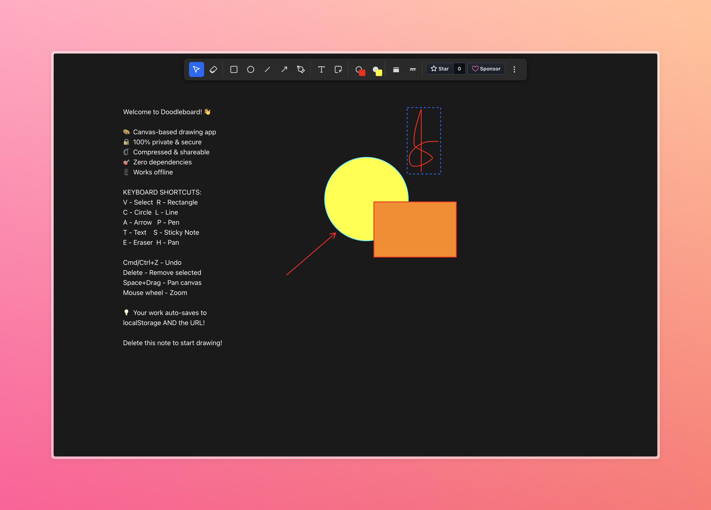

# Doodleboard

A _minimalist_ canvas-based drawing application that lives entirely in your browser. Draw shapes, annotate with text, and share everything via URL.

## Features

- 🎨 **Canvas Drawing** – Rectangles, circles, lines, arrows, freehand pen, text boxes, and sticky notes
- 🗜️ **Compression** – Your drawings get compressed with deflate
- 🔗 **Shareable** – Everything stored in localStorage and URL hash for easy sharing
- 🔒 **Secure & Private** – Zero server storage, all data stays in your browser
- 🎯 **Zero Dependencies** – Single HTML file, works offline as a PWA
- 🎨 **Full Customization** – Stroke/fill colors, line widths, solid/dashed styles
- ↩️ **Undo/Redo** – Full history with 100 state snapshots
- 🔍 **Pan & Zoom** – Navigate large canvases with ease
- 📱 **Mobile Friendly** – Touch-optimized for tablets and phones

## Drawing Tools

- **Select (V)** – Move and resize elements
- **Rectangle (R)** – Draw rectangles
- **Circle (C)** – Draw circles
- **Line (L)** – Draw straight lines
- **Arrow (A)** – Draw arrows
- **Pen (P)** – Freehand drawing
- **Text (T)** – Add text boxes
- **Sticky Note (S)** – Add colored sticky notes
- **Eraser (E)** – Delete elements

## Keyboard Shortcuts

### Tools

- `V` – Select tool
- `R` – Rectangle
- `C` – Circle
- `L` – Line
- `A` – Arrow
- `P` – Pen (freehand)
- `T` – Text
- `S` – Sticky note
- `E` – Eraser
- `H` – Pan (or hold `Space` + drag)

### Actions

- `Delete` / `Backspace` – Delete selected elements
- `Cmd/Ctrl + Z` – Undo
- `Cmd/Ctrl + Shift + Z` – Redo
- `Arrow Keys` – Nudge selected elements
- `Space + Drag` – Pan canvas
- `Mouse Wheel` – Zoom in/out

### Editing

- `Double-click` text element to edit
- `Shift + Click` – Add to selection
- Drag in empty area – Box selection

## Pro Tips

- Your data lives in localStorage (primary) AND the URL hash (for sharing)
- Add [`/qr`](https://textarea.my/qr) to get a QR code for the current page
- Change stroke/fill colors of existing shapes (except sticky notes)
- Use 8-point resize handles to adjust shape dimensions
- Drawings are automatically saved as you work

## Storage Format

- **Board Format**: `#board:<base64url_compressed_json>`
- **Compression**: Deflate-raw reduces JSON size by ~70-80%
- **Size limits**: localStorage preferred (5-10MB), URL hash for sharing (warns at >1MB)
- **Data Structure**: JSON containing viewport, elements array with all shapes/text/sticky notes

---

_Made with ❤️ and JavaScript_
